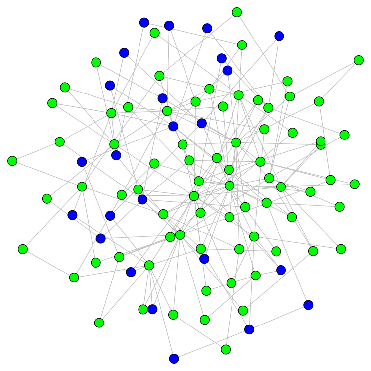
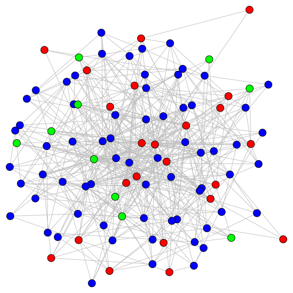

# Using network science to propose strategies for dealing with pandemics 

Authors: Helena A Herrmann1, Jean-Marc Schwartz2

1Faculty of Chemistry, The University of Vienna, Vienna, Austria
2Faculty of Biology, Medicine and Health, The University of Manchester, Manchester, United Kingdom

### Contacts

- helena.herrmann@univie.ac.at
- jean-marc.schwartz@manchester.ac.uk

The work in this repository is published as two separate articles, referred to as __Manuscript1__ and __Manuscript2__. 

Manuscript 1 was accepted for publication in a special issue of Physical Biology: 
- DOI: [10.1088/1478-3975/aba8ec](https://iopscience.iop.org/article/10.1088/1478-3975/aba8ec).

Manuscript 2 is in preparation/submission. 

# Manuscript 1: Why COVID-19 models should incorporate the network of social interactions

### Summary

The global spread of coronavirus disease 2019 (COVID-19) is overwhelming many health-care systems. As a result, epidemiological models are being used to inform policy on how to effectively deal with this pandemic. The majority of existing models assume random diffusion but do not take into account differences in the amount of interactions between individuals, i.e. the underlying human interaction network, whose structure is known to be scale-free. Here, we demonstrate how this network of interactions can be used to predict the spread of the virus and to inform policy on the most successful mitigation and suppression strategies. Using stochastic simulations in a scale-free network, we show that the epidemic can propagate for a long time at a low level before the number of infected individuals suddenly increases markedly, and that this increase occurs shortly after the first hub is infected. We further demonstrate that mitigation strategies that target hubs are far more effective than strategies that randomly decrease the number of connections between individuals. Although applicable to infectious disease modelling in general, our results emphasize how network science can improve the predictive power of current COVID-19 epidemiological models.

### Source Code

The `SIRModelSetUp` file provides an illustrative example of an SIR model run on a scale-free network. 

The `SIRModelSimulations` file generates the data for SIR models ran on 3 different networks.
(A scale-free network, a Mitigated Hub network were all nodes to have a degree of 8 or less, and a Mitigated Random network
where edges were removed randomly from nodes in the network).
All outputs are stored as pickle files. 

The `SIRModelAnalysis` file generates figures from the simulation saved when running the `SIRModelSimulations` file.

A snapshopt of the code at the time of submission can be found here: 

All of the simulations used to generate the figures in our publication are stored in the `ManuscriptData` zip file. 

# Manuscript 2: Why COVID-19 vaccination strategies should consider the network of social interactions

### Summary 

*insert Abstract* 

### Source Code 

The `SIRSModelSetUp` file is used to generate networks of a specific power-law distribution and a specific global clustering/ transitivity. 

The `SIRModelSimulations` file implements the SIRS models and runs it over networks of with different degree exponents and transitivies. All outputs are saved to a csv file for further analysis. 
The `SIRSModelSimulation_Vaccine` file does the same as the `SIRModelSimulations` file but allows for the implementation of different vaccination strategies. 

The `SIRSModelAnalysis` and the `SIRSModelAnalysis_Vaccine` files generates figures from the simulation saved when running the `SIRSModelSimulations` and the `SIRSModelSimulation_Vaccine` files, respectively.

A snapshot of the code at the time of submission can be found here: *insert Zenodo DOI*

