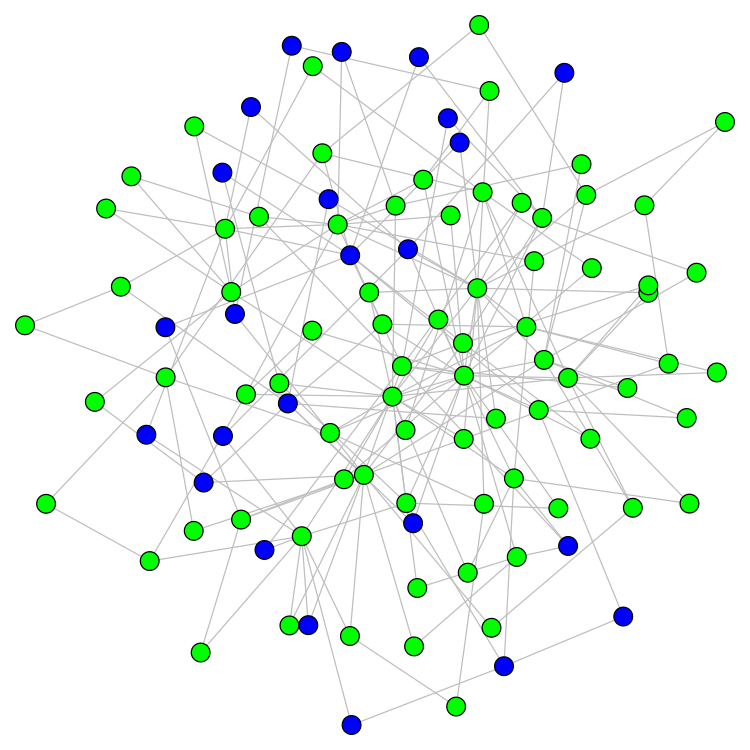

# Why COVID-19 models should incorporate the network of social interactions

Helena A Herrmann, Jean-Marc Schwartz

The University of Manchester

This research was accepted for publication in a special issue of Physical Biology: 
- DOI: [10.1088/1478-3975/aba8ec](https://iopscience.iop.org/article/10.1088/1478-3975/aba8ec)

# Summary

The global spread of Coronavirus Disease 2019 (COVID-19) is overwhelming many health-care systems. 
As a result, epidemiological models are being used to inform policy on how to effectively deal with this pandemic. 
We note that the majority of existing models do not take into account differences in the amount of interactions between 
individuals (i.e. the underlying human interaction network). 
Using network science we demonstrate how this network of interactions can be used to predict the spread of the virus 
and to inform policy on the most successful mitigation and suppression strategies. 
Although applicable to disease modelling in general, our results emphasize how network 
science can improve the predictive power of current COVID-19 epidemiological models. We provide commented source code 
for all our analyses so that they can easily be integrated into current and future epidemiological models. 

# Source Code

The `SIRModelsetUp` file provides an illustrative example of an SIR model run on a scale-free network. 

The `SIRModelSimulations` file generates the data for SIR models ran on 3 different networks.
(A scale-free network, a Mitigated Hub network were all nodes to have a degree of 8 or less, and a Mitigated Random network
where edges were removed randomly from nodes in the network).
All outputs are stored as pickle files. 

The `SIRModelAnalysis` files generates figures from the simulation saved when running the `SIRModelSimulations` file.

A snapshopt of the code at the time of the submission can be found here: 

All of the simulations used to generate the figures in our publication are stored in the `ManuscriptData` zip file. 

# Contacts

- helena.herrmann@univie.ac.at
- jean-marc.schwartz@manchester.ac.uk
